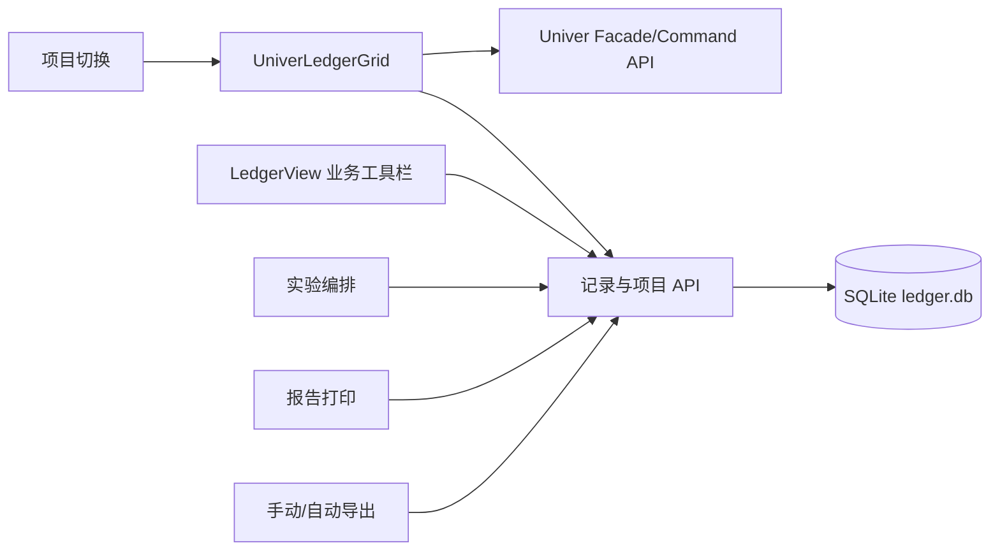

# Univer 接入架构

## 分层职责

### `UniverLedgerGrid.vue`

- 接收当前 `projectId`、字段定义和记录列表，生成一个活动 workbook。
- 建立 `sheet row (1 + index) -> ProjectRecord.id` 和 `column index -> FieldDefinition.id` 映射；第 0 行是冻结的表头。
- 通过 Facade API 处理选区、编辑、粘贴、撤销后的值变化、列宽和单元格底色。
- 只发出业务事件，不直接调用 HTTP；锁定行的本地编辑会被恢复。
- 项目或字段/记录结构变化时销毁并重建 workbook，组件卸载时释放 Univer 实例。

### `LedgerView.vue`

- 负责加载当前项目记录和字段、调用记录 API、处理选中记录的锁定/删除/状态/报告操作。
- 负责导入预览与提交、手动 Excel 导出和项目切换。
- 通过 `background-change` 将 Univer 的颜色命令同步到 `highlight_color`；清除按钮调用同一后端接口。

### 其他业务页面与后端

- `ExperimentsView.vue` 继续完成实验候选筛选、排序、编号编排和回写。
- `ReportsView.vue` 继续完成模板字段映射、DOCX 生成和 WPS/Word 打印。
- `AutoExportView.vue` 和后端调度器继续完成自动导出。
- FastAPI 继续负责记录锁定校验、审计、项目归属、导入导出和报告服务。

## Univer API 边界

当前 Univer 版本没有把旧实现中的 `SheetEditEnded` 或 `ClipboardPasted` 作为公共事件使用；值变更统一监听 `SheetValueChanged`。表格交互不通过 Element Plus 表格实例、`querySelector` 或自定义拖动逻辑实现。

Univer 的行号不是业务主键。排序、筛选或删除后，保存仍必须使用记录 UUID 和字段 ID；“清空单元格”和“删除数据库记录”由不同的业务动作处理。

## 数据库边界

迁移没有修改 schema，也不自动复制或清空数据库。测试时使用 `GENE_LEDGER_DATA_DIR` 指向独立副本；正式数据仍由原有配置目录提供。Univer workbook 是视图模型，不是新的持久化数据库。
