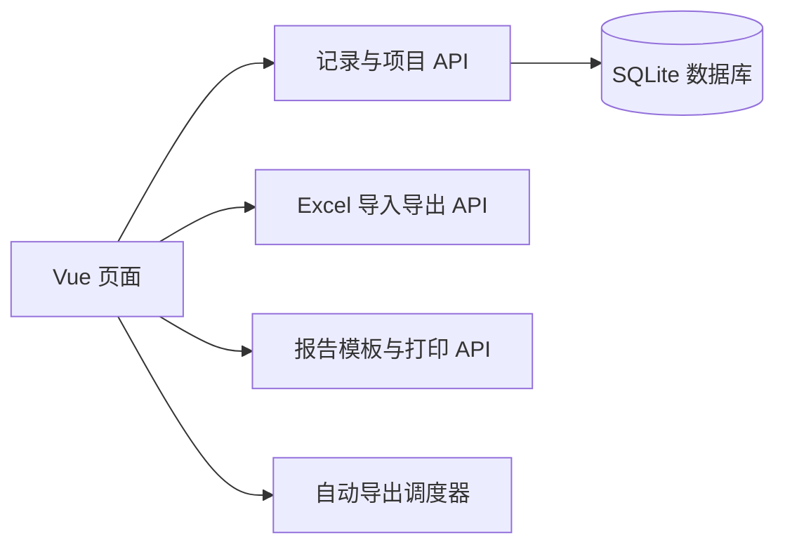
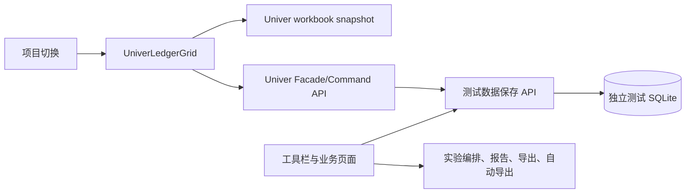

# Univer 接入架构

## 现有边界

当前台账由 Vue + Element Plus 渲染，后端使用 FastAPI、SQLAlchemy 和 SQLite。记录、字段、报告模板、导出任务都按 `project_id` 关联。

## 官方集成方式

项目当前使用 Vue 3 + Vite，迁移时采用 Univer 官方推荐的 preset 模式：`createUniver` + `UniverSheetsCorePreset`。实例只保存在普通 TypeScript 变量中，不放进 Vue 的响应式代理；组件挂载时创建，卸载或项目切换时 dispose。

首版使用本地 workbook/snapshot，不引入 Univer Server。表格交互全部通过 Univer Facade/Command API；FastAPI 只负责测试数据装载、测试数据保存、项目隔离、报告打印、Excel 手动导出和自动导出。当前业务数据库不参与迁移。

## Univer 的目标位置

Univer 不应成为业务数据库，也不应直接决定记录是否删除、是否锁定或实验编号是否冲突。表格中的行只保存到记录 ID 的映射，保存时使用记录 ID 和字段 ID。

测试期间禁止调用 `drop_all`、删除旧 SQLite 文件或用空 workbook 覆盖当前数据库。先读取测试库中的项目、字段和记录，再生成 Univer workbook；本阶段不对当前业务数据库增加字段、索引或其他迁移。

## 组件责任

### `UniverLedgerGrid.vue`

- 接收当前项目、字段定义和记录列表。
- 生成 `IWorkbookData`，建立 `rowIndex -> record.id`、`columnIndex -> field.id` 映射。
- 处理选区、编辑、复制粘贴、滚动和表格显示样式。
- 底色直接使用 Univer 原生 Fill color 命令和 cell style；业务层只负责把颜色同步到 `highlight_color`。
- 将修改转换为现有记录更新或批量导入请求。
- 项目切换、组件卸载时调用 Univer dispose，避免旧工作簿残留。

### 现有业务页面

- `ExperimentsView.vue`：保留实验候选筛选、排序、上下移动和编号编排。
- `ReportsView.vue`：保留模板字段映射、DOCX 生成和 WPS/Word 打印。
- `AutoExportView.vue`：保留自动导出任务和项目选择。
- `LedgerView.vue` 工具栏：保留底色、锁定、删除、状态和报告入口。

### 后端

- 记录更新和锁定校验继续由后端执行。
- `/imports/workbook/commit` 继续处理批量粘贴或 Excel 导入。
- `/exports/workbook` 继续生成手动 Excel 文件。
- 自动导出调度器和报告打印服务不因表格组件更换而改变。

## 不建议的做法

- 不把 Univer 的行号当作记录主键；排序、过滤和删除后行号会变化。
- 不让 Univer 直接执行业务删除；“清空单元格”和“删除数据库记录”必须分开。
- 不在第一阶段替换实验编排和报告页面的所有表格，避免同时引入多个交互回归点。
